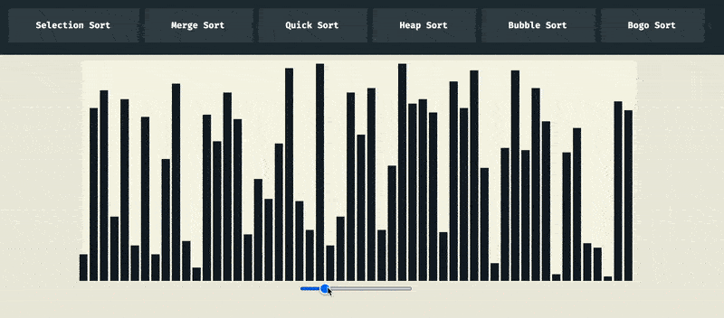

# Sorting Algorithm Visualizer 👁📈📉

This is a simple sorting algorithm visualizer I built in Javascript. It currently supports the following sorting algorithms:
- Selection Sort
- Merge Sort
- Quick Sort
- Heap Sort

The general infrastructure of the project allows for me to very easily add new sorting algorithms, so once I learn other algorithms in more depth, I'll add them to this visualizer 💪

<!-- TODO: add this to my portfolio and put a link here -->